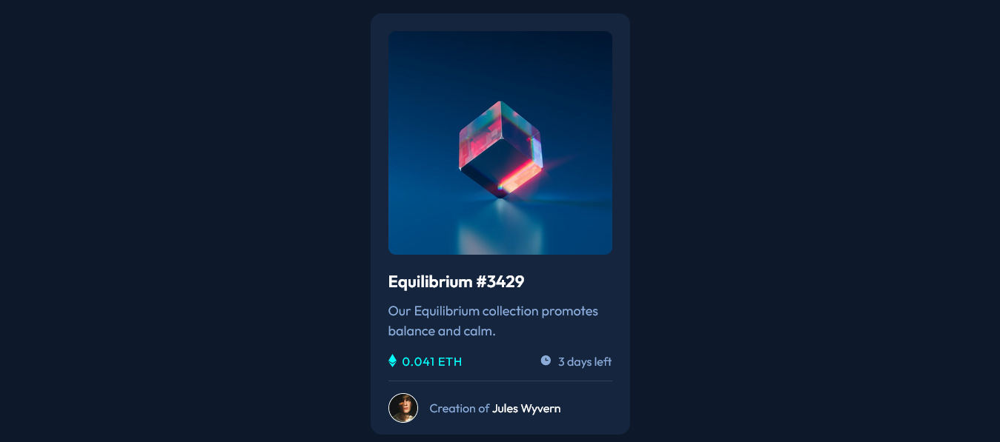

# Frontend Mentor - NFT preview card component solution

This is a solution to the [NFT preview card component challenge on Frontend Mentor](https://www.frontendmentor.io/challenges/nft-preview-card-component-SbdUL_w0U). Frontend Mentor challenges help you improve your coding skills by building realistic projects.

## Overview

### The challenge

- NFT Preview Card Component

### Screenshot

### Links

- Solution URL: (https://www.frontendmentor.io/solutions/nft-preview-card-component-challenge-mFkfLZhtUg)
- Live Site URL: (https://verakissyou17.github.io/nft-preview-card-component/)

## My process

### Built with

- Semantic HTML5 markup
- CSS custom properties
- Flexbox
- Mobile-first workflow

## Author

- Website - [Add your name here](https://github.com/verakissyou17)
- Frontend Mentor - [@yourusername](https://www.frontendmentor.io/profile/verakissyou17)
